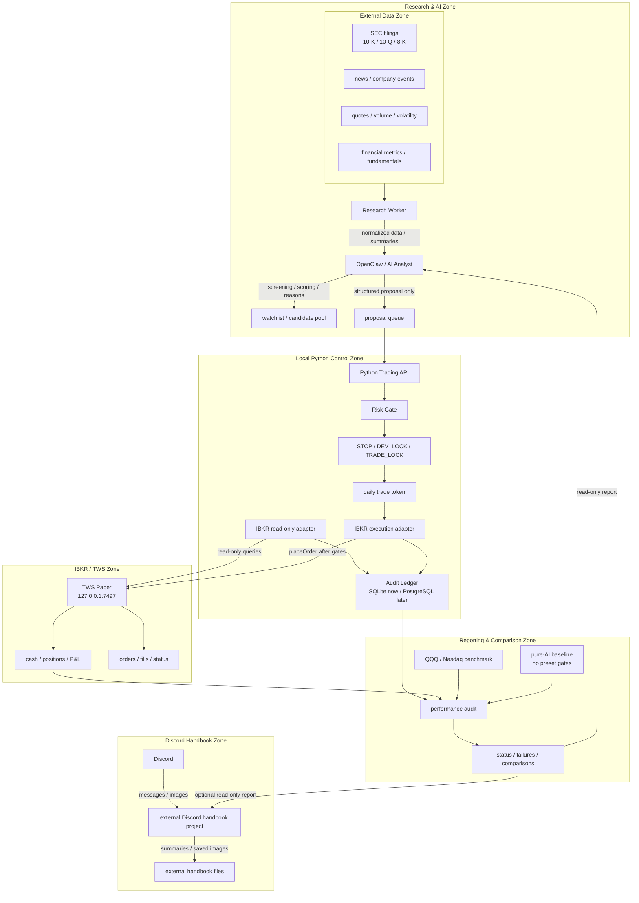
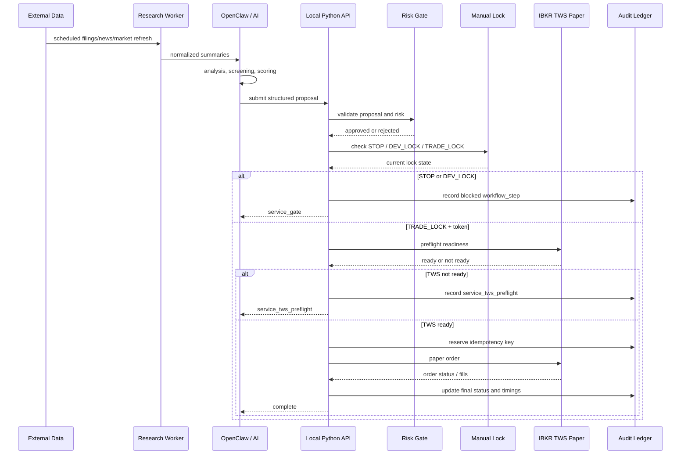

# Architecture

This project is organized around five layers: data, research, decision, risk,
and execution/audit. The core boundary is that Discord and OpenClaw do not touch
IBKR directly. All broker actions go through the local Python gateway.

## Layer Map



## Trigger And Confirmation Flow



## Tool Responsibilities

Discord handbook project:

- Moved out of this trading gateway to
  `/Users/nbhsbgnb/Documents/discord_handbook_project`.
- No trading permissions.

`openclaw/`:

- OpenClaw client and future AI analyst integration.
- May call the Python API.
- Must not connect directly to the IBKR/TWS port.

`api_service.py` and `trading/`:

- The controlled execution gateway.
- Owns parsing, risk checks, lock checks, TWS preflight, audit writes, and paper
  order submission.

`trading/tws_paper.py`:

- IBKR paper execution adapter.
- Long term, read-only IBKR functions should live beside but separate from this
  execution path.

`trading/audit.py`:

- SQLite execution audit for idempotency and order history.
- Future performance and research audit can move to PostgreSQL when multiple
  workers or larger datasets require it.

## Timing Optimization Path

The critical latency path is:

```text
data signal -> research summary -> OpenClaw decision -> proposal submit
-> Python parse -> risk -> lock/token -> TWS preflight -> audit reserve
-> placeOrder -> TWS acknowledgement -> audit update
```

Existing measured fields already cover the Python and broker portion:

- `openclaw_command_total_ms`
- `openclaw_http_round_trip_ms`
- `service_parse_ms`
- `service_risk_ms`
- `service_gate_ms`
- `service_tws_preflight_ms`
- `service_audit_reserve_ms`
- `service_broker_submit_ms`
- `broker_connect_handshake_ms`
- `broker_place_orders_ms`
- `broker_wait_ack_ms`
- `broker_total_ms`
- `service_audit_update_ms`
- `service_total_ms`

Future fields should cover the earlier decision path:

- `data_signal_received_at`
- `research_started_at`
- `research_finished_at`
- `openclaw_decision_started_at`
- `openclaw_decision_finished_at`
- `proposal_submitted_at`
- `order_acknowledged_at`

Optimization should start with measurement, then reduce repeated TWS handshakes,
avoid unnecessary full-context AI calls, cache normalized filings, and keep the
execution request payload small and structured.

## Fast Trade Check Mode

Research mode and fast trade check mode are intentionally different.

Research mode may spend time on:

- filings, news, and market context
- account, order, position, and P&L reads
- multiple AI reasoning passes
- report generation
- Discord or handbook summaries

Fast trade check mode starts only after the trading window, symbol, side, size,
and limit price are already selected. Its path is:

```text
prepared proposal -> OpenClaw paper-limit --fast -> Python API
-> parse -> risk -> lock/token -> TWS preflight -> audit reserve
-> placeOrder -> acknowledgement -> audit update
```

Fast mode must not perform these steps before submission:

- account order history query
- positions query
- market snapshot query
- report file generation
- attachment sending
- long narrative response

The OpenClaw `--fast` flag skips the OpenClaw-side health preflight to avoid a
duplicate TWS readiness check. It does not bypass the Python gateway. The Python
gateway still performs final risk, lock, daily token, TWS preflight,
idempotency, and audit checks.

The expected operator behavior is:

1. Use research mode before the window.
2. Keep read-only IBKR data warm in a cache.
3. Enter `TRADE_LOCK` locally when ready.
4. Use fast mode for the actual proposal submission.
5. Generate reports and attachments after the order response is recorded.

## Extension Space

The architecture reserves room for:

- factor models
- momentum and trend models
- mean reversion models
- volatility and risk parity models
- event-driven earnings models
- valuation models
- portfolio optimization
- benchmark comparison against QQQ/Nasdaq
- pure-AI baseline comparison without preset strategy rules

These models should produce structured scores or proposals. They should not gain
direct execution rights.

## Modular Learning Path

Each new finance concept should become a small, testable module before it can
influence execution. The first local strategy framework uses:

- `trading/market_data.py` for quote sources, quote cache, and bar building.
- `trading/strategy.py` for value-pool filtering, moving-average signals, and
  tactical entry planning.
- `scripts/run_strategy_simulation.py` for paper-only local simulation.

The pattern is:

```text
learn concept -> add model module -> write tests -> run simulation
-> compare with audit/benchmark -> only then consider paper execution
```

The water-and-filter model is intentional: the candidate pool is flowing water,
and Python filters liquidity, valuation, signal quality, spread, freshness,
risk, and duplicate intent before any proposal reaches execution.

The first free quote source is `StooqDelayedQuoteSource`. It is keyless and
simple enough to keep the framework moving, but it is delayed polling rather
than a true low-latency stream. Treat it as a research/bootstrap feed. Fast
execution should later use a warm IBKR read-only stream or another paid/approved
low-latency market-data feed.

## PostgreSQL Migration Threshold

SQLite is currently the right default for local execution audit because it is
simple, local, and has no service dependency.

PostgreSQL becomes worth it when at least one of these is true:

- multiple workers need concurrent writes
- research datasets become large
- dashboard queries become slow
- P&L and benchmark history need richer indexing
- AI analysis results need durable JSON/search queries
- the system needs a remote read-only reporting database

Migration should be staged:

1. Keep SQLite for execution idempotency.
2. Add PostgreSQL for research, market data, filings, model outputs, and
   performance history.
3. Mirror execution audit into PostgreSQL for reporting.
4. Only move execution idempotency off SQLite after the PostgreSQL path has been
   tested under failure conditions.
