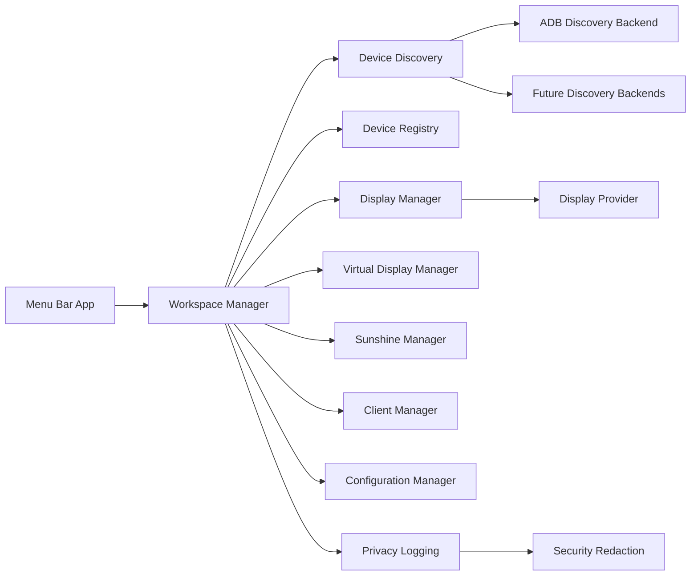

# Architecture

OpenWorkspace is organized around small, replaceable services. The app target owns UI and composition. The core target owns orchestration, models, configuration, logging, and integration boundaries.

## Components

Core coordinates app services and shared domain models.

Device Discovery is a composite service. The current functional backend detects Android devices via ADB. Bonjour, mDNS, USB, Bluetooth, and Wi-Fi backends are explicit placeholders.

Display Manager lists active macOS displays through public CoreGraphics APIs and delegates virtual display creation to a provider abstraction.

Display Provider is the integration boundary for virtual monitor creation. The first provider uses BetterDisplay CLI. OpenWorkspace does not call private CoreGraphics or CoreDisplay virtual-display APIs.

Sunshine Manager detects installation, checks running status, starts, stops, restarts, reads configuration, and validates configuration without logging raw values.

Client Manager prepares external clients without implementing custom streaming.

Workspace Manager orchestrates Phase 1 workflows: status refresh, discovery, registration, virtual display creation/destruction, Sunshine lifecycle, save, and restore.

Configuration Manager persists human-readable JSON for workspace settings only.

Logging emits INFO, WARNING, ERROR, and DEBUG messages after privacy redaction.

Security owns redaction rules and repository hygiene.

## Boundaries

OpenWorkspace does not copy, fork, or reimplement Sunshine, Moonlight, Sidecar, or BetterDisplay. Integrations must use documented interfaces, command line entry points, app launch services, or future public APIs.

## Virtual Display Research Summary

Apple documents APIs for enumerating and interacting with displays, but not a public app-level API that creates a standard user-session virtual monitor. OpenWorkspace therefore avoids undocumented APIs and uses `DisplayProviding` as a replaceable integration seam.

BetterDisplay documents virtual screen support and CLI integration for creating, connecting, and discarding virtual screens. The initial provider uses that external CLI when installed.

See [Virtual Display Workflow](VIRTUAL_DISPLAY.md) for the implemented Milestone 1 workflow.

See [BetterDisplay Integration](BETTERDISPLAY.md) for the full provider diagnostics and CLI contract.

References:

- [Apple CoreGraphics Display Services](https://developer.apple.com/documentation/coregraphics/display-services)
- [BetterDisplay](https://github.com/waydabber/BetterDisplay)
- [BetterDisplay CLI integration](https://github.com/waydabber/BetterDisplay/wiki/Integration-features%2C-CLI)
