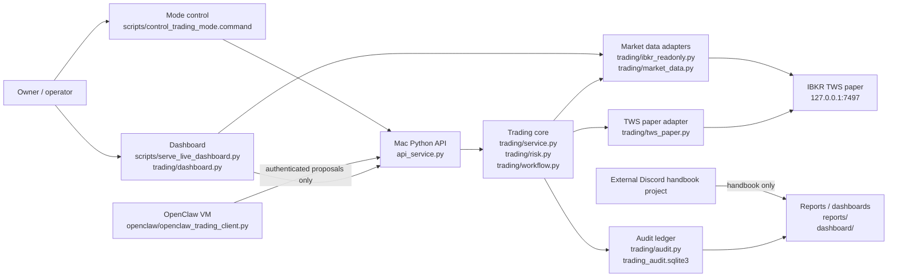
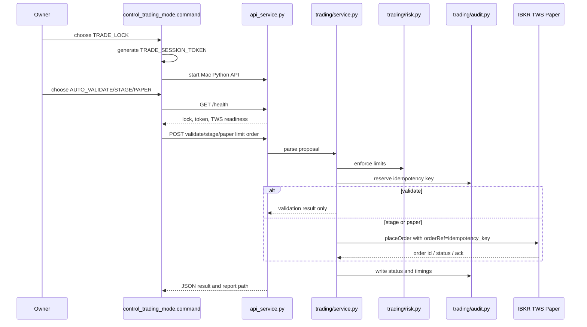
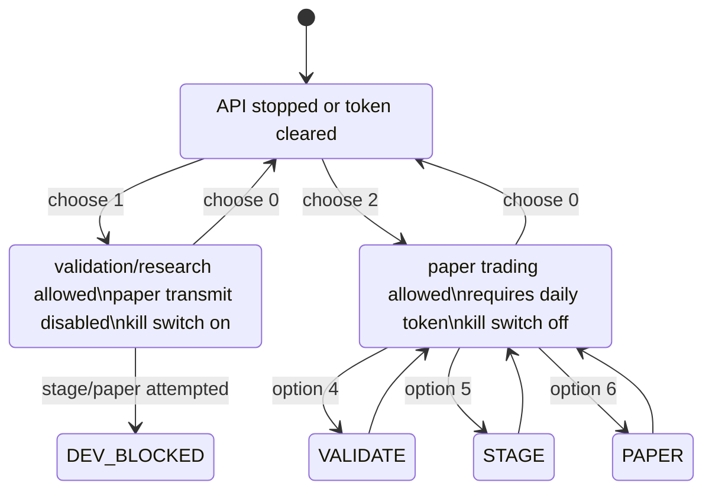
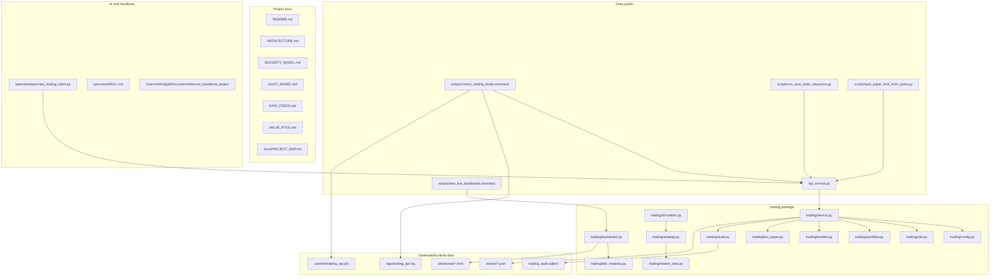

# Project Map

This document is the engineering map for the trading automation project. The
most useful chart types here are:

- C4 model: who owns which boundary.
- Sequence diagram: how a request moves through the system.
- State machine: which lock state allows which action.
- File dependency map: where to look before changing code.
- Strategy flow: `docs/STRATEGY_FLOW.md` is the maintained flow chart for
  pool scanning, filters, module decisions, and paper execution.

## 中文操作总览

这份文件是当前项目的总地图。以后如果忘了哪个模式做什么，先看这里。

### 最重要的结论

- `New project` 文件夹不要移动。
- 真正的交易控制入口是 `scripts/control_trading_mode.command`。
- 0、1、2 是基础锁状态。
- 3、4、5、6、7、8、9 是在已有 API / TRADE_LOCK 基础上执行的检查或自动化任务，不是新的独立锁状态。
- 4、5、6 更像一次性测试/序列工具。
- 7、8 是 classic conservative pool strategy。
- 9 是更完整的 autonomous agent：它会循环监控股票池、记录状态、并按节奏调用 7 的 pool strategy。
- 当前项目只应该用于 IBKR paper trading。live trading 没有安全启用路径。

### 启动顺序

推荐启动方式：

1. 运行 `scripts/control_trading_mode.command`。
2. 按 `2` 进入 `TRADE_LOCK`。
3. 选择 `b`，让 Trading API 在后台运行。
4. 再次运行 `scripts/control_trading_mode.command`。
5. 按 `9` 启动 `AUTONOMOUS_AGENT_BG`，或者按 `8` 启动 pool strategy 后台模式。

如果只是检查状态：

1. 先按 `2` 并选择 `b` 启动后台 API。
2. 再运行菜单，按 `3` 查看 health。

如果只是开发/不想下单：

1. 按 `1` 进入 `DEV_LOCK`。
2. 这个状态下 kill switch 开启，`ALLOW_PAPER_TRANSMIT=false`，不能 transmit paper order。

### 0-9 模式说明

| 键 | 名称 | 是否要先有 TRADE_LOCK API | 会不会下单 | 用途 | 当前建议 |
|---|---|---:|---:|---|---|
| 0 | STOP | 否 | 否 | 停止 API、pool strategy、agent，并清空 daily token | 安全退出时用 |
| 1 | DEV_LOCK | 否 | 否 | 开发/检查模式，kill switch 开启，paper transmit 关闭 | 写代码、检查配置时用 |
| 2 | TRADE_LOCK | 否 | 不直接下单 | 生成 daily `TRADE_SESSION_TOKEN`，启动 API，允许 paper transmit | 自动 paper 前必须先用 |
| 3 | HEALTH | 是 | 否 | 检查 API / TWS / lock / token / paper account | 每次交易前先看 |
| 4 | AUTO_VALIDATE_SEQ | 是 | 否 | 对 AAPL/MSFT/SPY 等做自动 validate，不发送 TWS order | 测试 API 和风控 |
| 5 | AUTO_STAGE_SEQ | 是 | 会发到 TWS，但 `transmit=False` | 创建未 transmit 的 staged order | 危险，容易留下手动 Transmit 单，少用 |
| 6 | AUTO_PAPER_SEQ | 是 | 是，paper limit order | 一次性自动发送 paper limit orders | 小心使用，偏测试 |
| 7 | POOL_STRATEGY_PAPER | 是 | 是，paper limit order | 前台运行 pool strategy | 临时观察用 |
| 8 | POOL_STRATEGY_BG | 是 | 是，paper limit order | 后台长期运行 pool strategy | 简单自动化可用 |
| 9 | AUTONOMOUS_AGENT_BG | 是 | 是，按计划调用 pool strategy | 后台 agent，监测股票池、写日志、周期性运行策略 | 当前最完整自动化入口 |

注意：4-9 不是“另一个 trade lock”。它们会去找一个已经运行的 Trading API。通常你先按 `2`，选择 `b` 后台启动 API，然后再按 4-9。

### 当前自动化模式是什么

当前最完整的自动化模式是 `9) AUTONOMOUS_AGENT_BG`。

它实际运行：

- `scripts/run_autonomous_trading_agent.py`
- 默认每 `30` 秒一轮：`AGENT_CYCLE_SECONDS`，代码默认 `--cycle-seconds 30`
- 默认每 `2` 轮运行一次策略：`AGENT_STRATEGY_EVERY_CYCLES=2`
- 所以默认大约每 `60` 秒尝试跑一次 pool strategy
- 每次策略默认只跑 `1` 个 step：`AGENT_STRATEGY_STEPS=1`
- 每次策略最多提交 `4` 个订单：`AGENT_STRATEGY_MAX_ORDERS=4`

对应文件：

- agent 主循环：`scripts/run_autonomous_trading_agent.py`
- agent 最新状态：`reports/autonomous_agent/latest.json`
- agent 每轮日志：`reports/autonomous_agent/cycles.jsonl`
- agent 后台 pid：`.runtime/autonomous_agent.pid`
- agent 运行日志：`logs/autonomous_agent.log`

### 一轮是多长时间

不同模式的“一轮”不一样：

| 模式 | 一轮含义 | 默认周期 |
|---|---|---:|
| 8 `POOL_STRATEGY_BG` | pool strategy 的一个 scan step | `60` 秒一次，来自 `POOL_STRATEGY_POLL_SECONDS:-60` |
| 9 `AUTONOMOUS_AGENT_BG` | agent cycle | `30` 秒一次，来自 `AGENT_CYCLE_SECONDS:-30` |
| 9 内部策略 | 每隔几个 agent cycle 跑一次 pool strategy | 默认每 `2` 轮，即约 `60` 秒 |
| 7 `POOL_STRATEGY_PAPER` | 前台一次跑 24 steps | 默认 `poll_seconds=0`，所以会快速跑完，除非手动设置 |
| 4/5/6 `AUTO_*_SEQ` | 一次性序列 | 不是循环 |

### 能不能实时同时监测股票池

可以，但要分清模式。

`9) AUTONOMOUS_AGENT_BG` 会每轮选出最多 60 个 monitor symbols，并用并行 IBKR readonly quote source 取行情：

- 代码位置：`scripts/run_autonomous_trading_agent.py`
- 选池函数：`select_monitor_symbols`
- 取行情函数：`fetch_quotes`
- 默认最大池子：`AGENT_MAX_UNIVERSE_SYMBOLS:-60`
- 默认并行 worker：`AGENT_IBKR_WORKERS:-8`
- 默认每个 worker：`AGENT_IBKR_SYMBOLS_PER_WORKER:-8`
- 股票池文件：`data/us_equity_universe.csv`

`8) POOL_STRATEGY_BG` 也会监测池子，而且脚本默认带 `--full-pool-each-step`，所以每个 step 会请求当前选中的全部 pool symbols：

- 代码位置：`scripts/run_pool_strategy_module.py`
- 默认最大池子：`POOL_STRATEGY_MAX_UNIVERSE_SYMBOLS:-60`
- 默认每 60 秒一次：`POOL_STRATEGY_POLL_SECONDS:-60`
- 输出报告：`reports/pool_strategy_module_*.json`
- dashboard：`dashboard/pool_strategy_dashboard.html`

`7) POOL_STRATEGY_PAPER` 前台模式默认没有 `--full-pool-each-step`，除非设置环境变量 `POOL_STRATEGY_FULL_POOL_EACH_STEP=1`。否则默认 batch size 是 12，也就是每 step 轮流看一部分。

### 股票池在哪里

主股票池在：

- `data/us_equity_universe.csv`

读取和筛选逻辑在：

- `trading/universe.py`
- `scripts/run_autonomous_trading_agent.py`
- `scripts/run_pool_strategy_module.py`

筛选会结合：

- CSV 里的 `enabled`
- tags / sector
- value score
- gateway allowlist
- `max_universe_symbols`

### 限价单生成逻辑

当前有两条主要下单路径。

#### Pool strategy 路径，主要来自 7/8/9

文件：

- `scripts/run_pool_strategy_module.py`
- `trading/strategy_modules.py`

逻辑：

1. 从 IBKR readonly quote 取行情。
2. 对每个 symbol 建 bar history。
3. `ConservativeTrendModule.evaluate` 判断是否 BUY / SELL / HOLD。
4. BUY 条件大致是 fast SMA > slow SMA，并且价格确认趋势。
5. BUY limit price 使用 `quote.ask`，没有 ask 就用 midpoint/last，然后 round 到 2 位。
6. SELL limit price 使用 `quote.bid`，没有 bid 就用 midpoint/last，然后 round 到 2 位。
7. `order_payload` 生成 JSON。
8. 根据 mode 调用：
   - `validate` -> `/v1/orders/validate/limit`
   - `stage` -> `/v1/orders/stage/limit`
   - `paper` -> `/v1/orders/paper/limit`

重要：pool strategy 当前发的是 single limit order，不是 bracket order，所以它本身不附带 stop child order。

#### Autonomous runtime bracket 路径

文件：

- `trading/autonomous_runtime.py`
- `trading/strategy.py`
- `trading/tws_paper.py`

逻辑：

1. scanner 生成 proposal，里面包含 `stop_price`。
2. runtime 调用 `TradingService.submit(..., transmit=True)`。
3. `TradingService` 调用 `TwsPaperBroker.submit_bracket`。
4. `TwsPaperBroker._bracket_orders` 创建 parent limit entry 和 child stop。

### Transmit 逻辑

API endpoint 决定 transmit：

- `/v1/orders/validate`：只验证，不进 TWS。
- `/v1/orders/validate/limit`：只验证，不进 TWS。
- `/v1/orders/stage`：进 TWS，但 `transmit=False`。
- `/v1/orders/stage/limit`：进 TWS，但 `transmit=False`。
- `/v1/orders/paper`：进 TWS，`transmit=True`。
- `/v1/orders/paper/limit`：进 TWS，`transmit=True`。

single limit order：

- 文件：`trading/tws_paper.py`
- `_limit_order` 里 `order.transmit = transmit`
- paper mode 下就是 `True`
- stage mode 下就是 `False`

bracket order：

- 文件：`trading/tws_paper.py`
- parent limit entry 永远 `parent.transmit = False`
- child stop 使用 `stop.transmit = transmit`
- 这是 bracket order 的常见模式：最后一个 child transmit 时，整组订单一起提交

为什么会看到手动 Transmit：

- 如果你用了 stage endpoint，订单本来就是未 transmit。
- 如果 bracket parent 已进 TWS，但 child stop 因价格 tick size 等原因被拒，parent 可能残留为未 transmit。
- 审计库里已经出现过 TWS error 110：`The price does not conform to the minimum price variation for this contract.`
- 所以下一步应修 stop price tick rounding，并在 child 失败时自动 cancel parent。

### 当前主要风险限制

API 级别：

- `MAX_QUANTITY`：默认 1
- `MAX_ORDER_VALUE`：默认 200；TRADE_LOCK 菜单里设为 400
- `MAX_RISK_PER_ORDER`：默认 10
- `ALLOWED_SYMBOLS`
- `TRADING_KILL_SWITCH`
- `ALLOW_PAPER_TRANSMIT`
- `TRADE_SESSION_TOKEN`

Pool strategy 级别：

- `--max-orders`：默认 4
- `--max-open-positions`：默认 4
- `--max-symbol-market-value`：默认 400
- `--max-gross-market-value`：默认 1200
- `--max-daily-loss`：默认 25
- `--max-consecutive-losses`：默认 3

Autonomous agent 级别：

- `AGENT_CYCLE_SECONDS`：默认 30
- `AGENT_STRATEGY_EVERY_CYCLES`：默认 2
- `AGENT_STRATEGY_MAX_ORDERS`：默认 4
- `AGENT_MAX_UNIVERSE_SYMBOLS`：默认 60

目前没有真正的 daily total trade value cap。现在有的是单笔金额、session 订单数、仓位和亏损限制。

### 日常看哪些文件

如果想知道现在 agent 在干什么：

- `reports/autonomous_agent/latest.json`
- `reports/autonomous_agent/cycles.jsonl`
- `logs/autonomous_agent.log`

如果想知道策略是否生成订单：

- `reports/pool_strategy_module_*.json`
- `dashboard/pool_strategy_dashboard.html`
- `logs/pool_strategy.log`

如果想知道订单有没有进 TWS / 是否 pending confirmation：

- `trading_audit.sqlite3`
- API `/v1/orders/audit`
- `scripts/list_tws_orders.py`

如果想知道 API 是否允许下单：

- 菜单按 `3) HEALTH`
- `logs/trading_api.log`

### 安全建议

- 平时不要用 `5) AUTO_STAGE_SEQ`，除非你明确想测试 untransmitted TWS staged order。
- 想要长期 paper 自动化，优先用 `9) AUTONOMOUS_AGENT_BG`。
- 想要简单一点的长期策略，优先用 `8) POOL_STRATEGY_BG`。
- 不要直接改 `trading_audit.sqlite3`。
- 不要删除 `reports/*.jsonl`，可以以后归档。
- 不要把 parent bracket order 简单改成 `transmit=True`。正确修法是 child stop 价格合法化，并在 child 失败时 cancel parent。

## C4 Container Map

## Order Sequence

## Lock State Machine

## File Map

## Where To Change Things

Trading safety:

- `trading/risk.py`
- `trading/service.py`
- `trading/config.py`
- `SECURITY_MODEL.md`

IBKR connectivity:

- `trading/tws_paper.py`
- `trading/ibkr_readonly.py`
- `scripts/diagnose_market_data_channels.py`
- `scripts/benchmark_ibkr_quote_batches.py`

Automatic order runs:

- `scripts/control_trading_mode.command`
- `scripts/run_auto_order_sequence.py`
- `scripts/auto_paper_limit_from_quote.py`

Dashboard:

- `scripts/serve_live_dashboard.py`
- `trading/dashboard.py`
- `dashboard/live_strategy_dashboard.html`

Research and strategy modules:

- `trading/strategy.py`
- `trading/strategy_modules.py`
- `trading/simulation.py`
- `docs/STRATEGY_FLOW.md`
- `VALUE_POOL.md`
- `DATA_FEEDS.md`

External related projects:

- Discord handbook: `/Users/nbhsbgnb/Documents/discord_handbook_project`
- Croatian A1 Anki deck: `/Users/nbhsbgnb/Documents/Hrvatski/anki_a1_project`
- Wind/storage MPC model: `/Users/nbhsbgnb/Documents/wind_storage_mpc_project`
