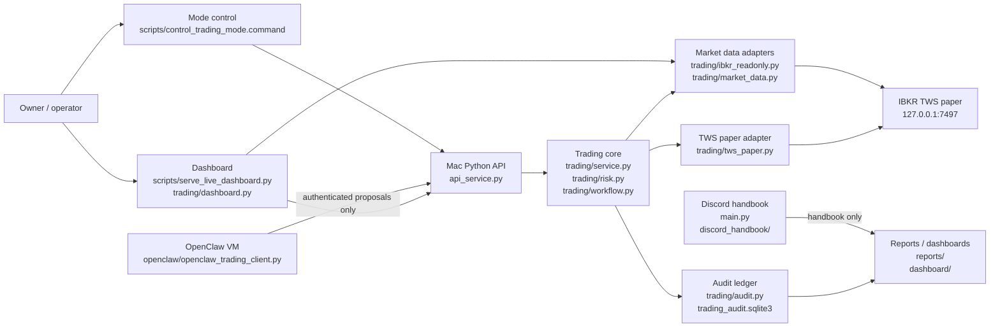
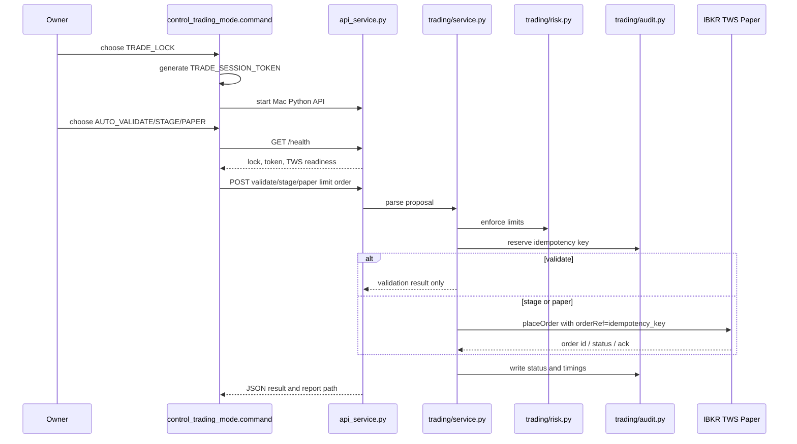
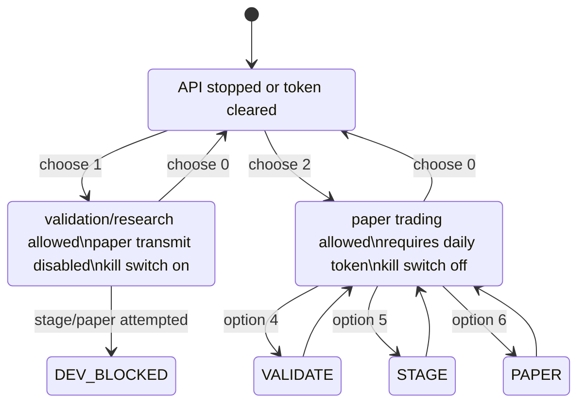
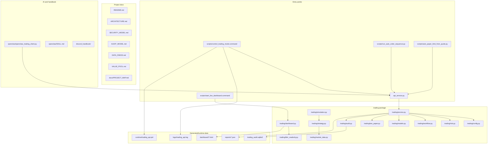

# Project Map

This document is the engineering map for the trading automation project. The
most useful chart types here are:

- C4 model: who owns which boundary.
- Sequence diagram: how a request moves through the system.
- State machine: which lock state allows which action.
- File dependency map: where to look before changing code.

## C4 Container Map

## Order Sequence

## Lock State Machine

## File Map

## Where To Change Things

Trading safety:

- `trading/risk.py`
- `trading/service.py`
- `trading/config.py`
- `SECURITY_MODEL.md`

IBKR connectivity:

- `trading/tws_paper.py`
- `trading/ibkr_readonly.py`
- `scripts/diagnose_market_data_channels.py`
- `scripts/benchmark_ibkr_quote_batches.py`

Automatic order runs:

- `scripts/control_trading_mode.command`
- `scripts/run_auto_order_sequence.py`
- `scripts/auto_paper_limit_from_quote.py`

Dashboard:

- `scripts/serve_live_dashboard.py`
- `trading/dashboard.py`
- `dashboard/live_strategy_dashboard.html`

Research and strategy modules:

- `trading/strategy.py`
- `trading/simulation.py`
- `VALUE_POOL.md`
- `DATA_FEEDS.md`

Discord handbook:

- `discord_handbook/`
- `requirements-discord.txt`
- `handbook/`
