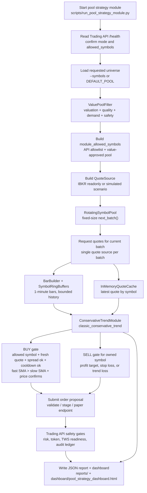

# Strategy Flow

This document is the maintained flow chart for the modular pool strategy. Update
it whenever the stock universe, data feed, filter stack, strategy modules, or
execution gates change.

## Current Pool Strategy Flow

## Current Logic

- The scanner does not open a separate long-lived channel per symbol. It rotates
  through the universe in fixed-size batches and asks one quote source for each
  batch.
- `InMemoryQuoteCache` keeps the latest quote per symbol.
- `SymbolRingBuffers` keeps bounded bar history per symbol, so memory stays
  stable as the universe grows.
- The first strategy module is `classic_conservative_trend`, a long-only paper
  module.
- BUY requires an approved symbol, fresh quote, acceptable spread, no cooldown,
  enough bar history, fast SMA above slow SMA, and price above slow SMA.
- SELL only follows an in-memory BUY position and triggers on profit target,
  stop loss, or fast SMA falling below slow SMA.

## Current Defaults

- Default pool: `AAPL,MSFT,AMD,INTC,KO,PFE,T,F`
- Default batch size: `3`
- Default module windows: fast `2`, slow `3`
- Default paper test quantity: `1`
- Default profit target: `0.15%`
- Default stop loss: `0.15%`
- Dashboard output: `dashboard/pool_strategy_dashboard.html`

## Market Data Permission Plan

For a broad US equity pool, keep these market data subscriptions active:

- `NYSE (Network A/CTA)(NP,L1)`
- `NYSE American, BATS, ARCA, IEX, and Regional Exchanges (Network B)(NP,L1)`
- `NASDAQ (Network C/UTP)(NP,L1)`

These three cover the practical first layer for US listed equities. Add options,
futures, OTC, or international exchanges only when a strategy module actually
uses those instruments.
